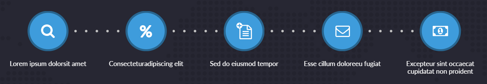
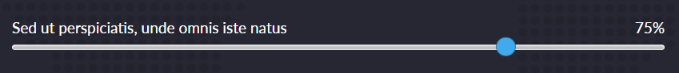

## О проекте
- адаптивная верстка, минимальное разрешение 320px
- нейминг в соответствии с методологией БЭМ
- используется препроцессор SASS в диалекте SCSS
- поддержка последних 3 версий браузеров
- js и css файлы минифицированны
- картинки оптимизированы переведены в webp
- для svg используется sprite
- header фиксированный
- для списка используется библиотека <a href="https://swiperjs.com/">swiper</a> 

- для ренжа используется библиотека <a href="https://refreshless.com/nouislider/">noUiSlider</a> 

### Краткая инструкция по сборке
Для начала работы должен быть установлен **Node.js** 14 версии

#### Основные команды для работы
- Установка - `npm i`
- Запуск локального сервера - `npm start`
- Сборка проекта, минификация скриптов  
и оптимизация изображений перед деплоем на прод - `npm run build`
- Запуск тестирования на соответствия кодгайдам - `npm test`
- Создание webp изображений в директории source - `npm run webp`

#### Вся разработка ведётся в директории `source`
#### Итоговый код попадает в директорию `build`
